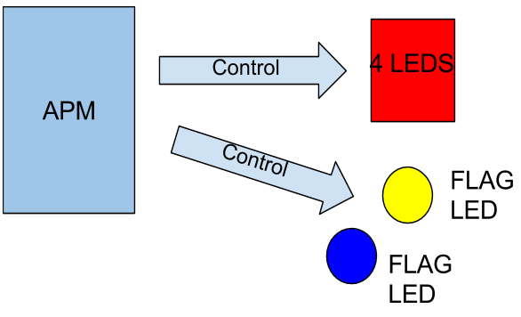

# Team Flag

The Flag for the Robot, display California Gold or Yale Blue.

### Pinouts:

Arduino Pro Micro | Team Flag
---- | -----------------
A3 | LED4(RED)
A2 | LED3(RED)
A1 | LED2(RED)
2 | GND
3 | GND
VCC | 5V
7 | LED5(BLUE)
8 | LED6(YELLOW)
GND | GND

### Testing

Upload BlinkTest.ino to the APM, with the correct pins for the Team Flag connected.
If the board is working correctly, then each of the TeamFlag’s six LEDs will be turned on and off in sequence, with a small delay between each LED’s blinking process.

Y9: Changed the Arduino interface to be SMD last minute, which caused issues. The GND planes were no longer connected very well, sop there were a lot of fabrication errors. THe lesson to be learned here is that 1. Don't change things very last minute, and 2, if you need to connect multiple planes, do it on multiple locations so that they are actually connected.

Y10: Avererorero Kandala

[Proposed SPDT switch](https://www.digikey.com/product-detail/en/e-switch/100SP1T2B4M6QE/EG2362-ND/378831)

[Proposed Micro USB connector](https://www.digikey.com/product-detail/en/molex-llc/0475890001/WM17143CT-ND/1832255)

## Changes
* Look into SMD single pole triple throw part
* Obtain footprint and add as new part
* Find an easy microUSB SMD component
* Make sure it has a big keep out region
* Obtain footprint of said component and attach to board
* Add more holes to connect GND planes
